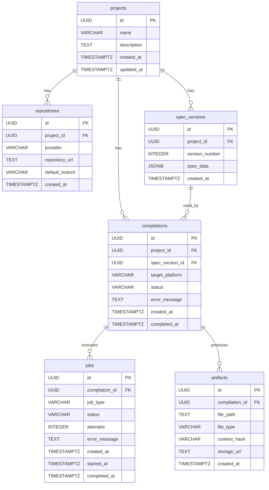

# Task 3: PostgreSQL Database ERD

## AgentForge Database Design

```mermaid
erDiagram
    projects ||--o{ repositories : has
    projects ||--o{ spec_versions : has
    projects ||--o{ compilations : has
    spec_versions ||--o{ compilations : used_by
    compilations ||--o{ jobs : executes
    compilations ||--o{ artifacts : produces

    projects {
        UUID id PK
        VARCHAR name
        TEXT description
        TIMESTAMPTZ created_at
        TIMESTAMPTZ updated_at
    }

    repositories {
        UUID id PK
        UUID project_id FK
        VARCHAR provider
        TEXT repository_url
        VARCHAR default_branch
        TIMESTAMPTZ created_at
    }

    spec_versions {
        UUID id PK
        UUID project_id FK
        INTEGER version_number
        JSONB spec_data
        TIMESTAMPTZ created_at
    }

    compilations {
        UUID id PK
        UUID project_id FK
        UUID spec_version_id FK
        VARCHAR target_platform
        VARCHAR status
        TEXT error_message
        TIMESTAMPTZ created_at
        TIMESTAMPTZ completed_at
    }

    jobs {
        UUID id PK
        UUID compilation_id FK
        VARCHAR job_type
        VARCHAR status
        INTEGER attempts
        TEXT error_message
        TIMESTAMPTZ created_at
        TIMESTAMPTZ started_at
        TIMESTAMPTZ completed_at
    }

    artifacts {
        UUID id PK
        UUID compilation_id FK
        TEXT file_path
        VARCHAR file_type
        VARCHAR content_hash
        TEXT storage_url
        TIMESTAMPTZ created_at
    }
```
